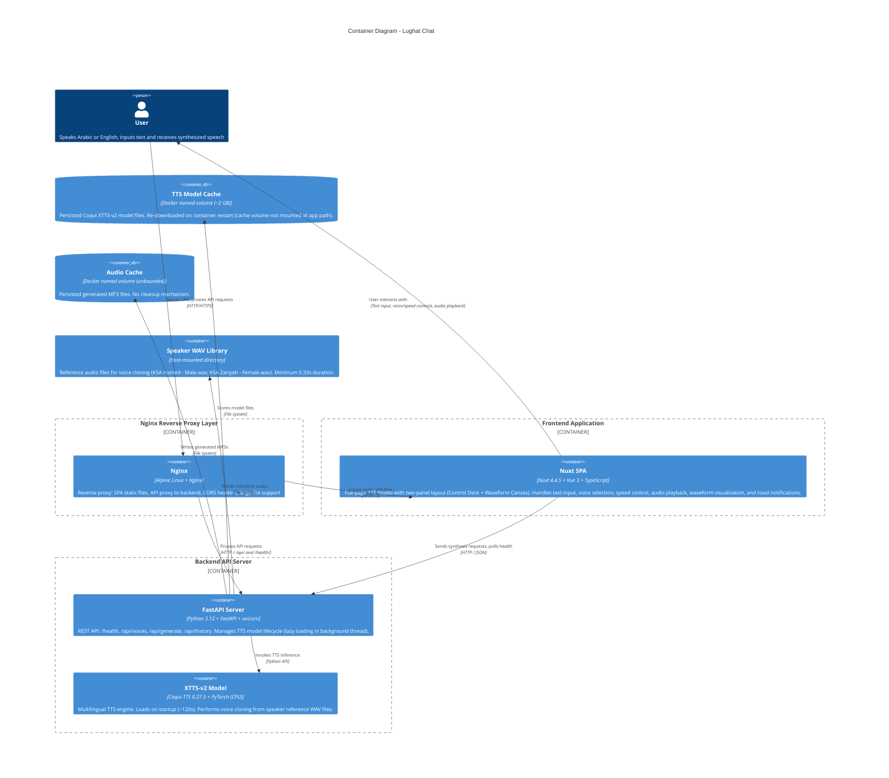

# C4 Container Diagram — Lughat Chat

> **System:** Lughat Chat — Arabic Text-to-Speech Studio
> **Generated:** 2026-07-05
> **Level:** 2 — Container (Apps, services, data stores, and their interactions)

---

## Diagram

## Container Inventory

| Container | Technology | Responsibility | Host / Port |
|-----------|-----------|----------------|-------------|
| **Nginx** | nginx:alpine | Reverse proxy: serves SPA static files, proxies `/api/` and `/health` to backend, handles CORS, disables buffering for large audio responses | Docker network, port 9001:80 |
| **Nuxt SPA** | Nuxt 4.4.5 + Vue 3 + TypeScript + UnoCSS | Full-page TTS Studio: text input (RTL Arabic), voice/speed controls, audio playback, waveform visualization, toast notifications, health polling | Docker network, port 9001:80 (served by Nginx) |
| **FastAPI Server** | Python 3.12 + FastAPI 0.115.6 + uvicorn | REST API: `/health`, `/api/voices`, `/api/generate`, `/api/history`. Background TTS model loading. Static file serving for downloads/speaker_wavs. | Docker network, port 9000:8000 |
| **XTTS-v2 Model** | Coqui TTS 0.27.5 + PyTorch (CPU-only) | Multilingual TTS engine. Loads on startup (~120s). Clones voices from reference WAV files. CPU-only inference takes several seconds per request. | Inside backend container |
| **TTS Model Cache** | Docker named volume | Persists ~2GB TTS model files. Currently **not used for persistence** — model is re-downloaded on each restart (env var `TTS_MODEL_CACHE` points to `/app/.cache/tts`, not the volume mount). | Docker volume: `tts-model-cache` |
| **Audio Cache** | Docker named volume | Persists generated MP3 files. No cleanup mechanism. | Docker volume: `tts-audio-cache` |
| **Speaker WAV Library** | Host-mounted directory | Reference audio files for voice cloning. Dynamically discovered via `/api/voices`. | `./backend/speaker_wavs/` on host, mounted to `/app/speaker_wavs/` in container |

## Key Interactions

### User → Nginx → Nuxt SPA
- Browser loads the SPA from Nginx (static files served from `/usr/share/nginx/html`)
- Nginx serves SPA with SPA fallback (`try_files $uri $uri/ /index.html`)
- Static assets (JS, CSS, images) cached for 30 days

### Nginx → FastAPI (API Proxy)
- Nginx proxies `/api/*` and `/health` requests to the backend container (`lughat-backend:8000`)
- Large file support: `proxy_buffering off`, `proxy_request_buffering off`, 1800s timeout for long TTS synthesis
- CORS headers added for all responses (frontend container access)

### Frontend → Backend (API Calls)
- **Health polling**: Every 2 seconds, checks `/health` until model is ready (max 10 retries)
- **Synthesis**: POST `/api/generate` with JSON body → receives MP3 binary blob
- **Voices**: GET `/api/voices` → returns discovered voice list from speaker_wavs directory
- **History**: GET `/api/history` → returns list of previously generated audio files

### Backend → TTS Engine
- XTTS-v2 model loaded in a background thread during FastAPI startup (lifespan)
- Model states: `"loading"` → `"ready"` (or `"error"`)
- Synthesis: `tts_to_file()` with speaker reference WAV → generates WAV → ffmpeg converts to MP3 at 192k bitrate
- Deterministic output via PyTorch random seed (defaults to 42)

## Architecture Decisions

1. **Nginx as reverse proxy** — Decouples frontend serving from API proxying. Handles CORS, SPA routing, and large-file streaming in one layer.
2. **API proxy at Nginx level** — Frontend makes relative URL calls (`/api/generate`); Nginx routes to the backend container. No hardcoded backend URLs in frontend code.
3. **Background model loading** — FastAPI starts serving requests immediately; TTS model loads asynchronously in a daemon thread. Health polling handles the ~120s loading window.
4. **Speaker WAV directory** — Voices are dynamically discovered at runtime by scanning `.wav` files. No hardcoded voice list.
5. **Docker named volumes** — Model cache and audio cache use named volumes. Model cache is currently **not used for persistence** (env var overrides the mount point).

## Cross-Cutting Concerns

| Concern | Implementation |
|---------|---------------|
| **CORS** | Nginx adds `Access-Control-Allow-Origin: *` header; FastAPI also has `CORSMiddleware` (all origins) |
| **Large file support** | Nginx: `proxy_buffering off`, 1800s timeouts. FastAPI: `FileResponse` for streaming MP3. |
| **Model readiness** | Health endpoint returns status (`loading`/`ready`/`error`). Frontend polls every 2s with max 10 retries. |
| **CSP / Security** | Nginx serves `nginx-health` without logging. Backend has full CORS (restricted in production). |
| **Error handling** | Frontend: toast notifications with auto-dismiss. Backend: `HTTPException` with descriptive messages. |
| **Arabic RTL** | Cairo font (Google Fonts), `dir="rtl"` on textarea, `font-arabic` CSS class. |
