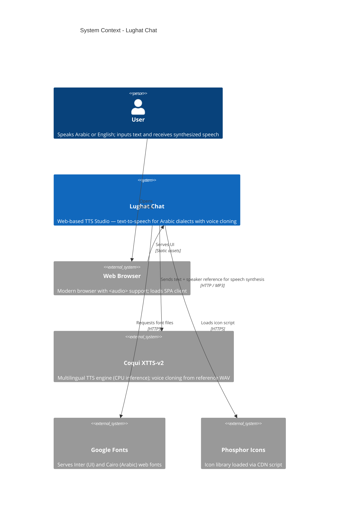

# C4 Context Diagram — Lughat Chat

> **System:** Lughat Chat — Arabic Text-to-Speech Studio
> **Generated:** 2026-07-05
> **Level:** 1 — System Context (Who interacts with the system and what external systems it depends on)

---

## Diagram

## Legend

| Element | Description |
|---------|-------------|
| **User** | End user who types Arabic/English text and listens to the synthesized speech |
| **Lughat Chat** | The web application — a two-panel TTS studio (Control Deck + Waveform Canvas) |
| **Web Browser** | User's browser running the Nuxt SPA; handles `<audio>` playback |
| **Coqui XTTS-v2** | Backend TTS inference engine; clones voices from reference WAV files |
| **Google Fonts** | CDN serving "Inter" (UI labels) and "Cairo" (Arabic text) fonts |
| **Phosphor Icons** | CDN-hosted icon library loaded via `<script>` tag |

## Key Relationships

| From | To | Protocol | Description |
|------|----|----------|-------------|
| User → Browser | — | — | User opens the application in a browser |
| Browser → Lughat Chat | HTTP/HTTPS | Loads the Nuxt SPA, sends synthesis requests |
| Lughat Chat → Coqui XTTS-v2 | HTTP (internal) | POSTs text + voice parameters; receives MP3 binary |
| Lughat Chat → Google Fonts | HTTPS | Preconnect + stylesheet fetch for Inter + Cairo fonts |
| Lughat Chat → Phosphor Icons | HTTPS | Loads icon script from unpkg CDN |

## Notes

- The browser communicates with Lughat Chat through Nginx (reverse proxy) in production. In local development, Nitro's devProxy handles routing.
- The TTS engine runs inside a Docker container and is not directly accessible from the browser.
- Google Fonts and Phosphor Icons are external CDN dependencies loaded by the browser, not the backend.
